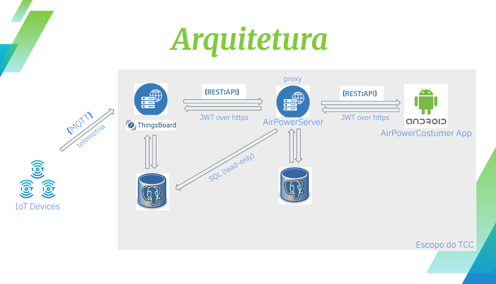
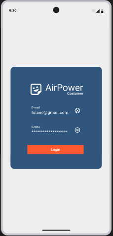
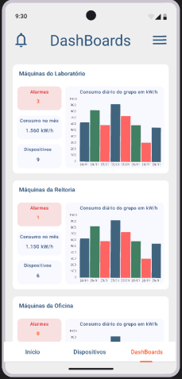
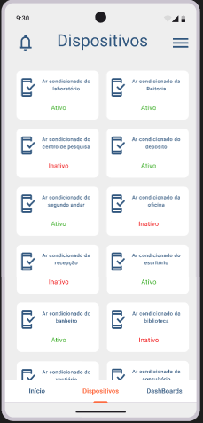
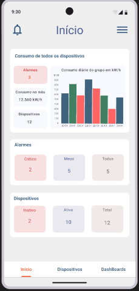

# Projeto de TCC: Aplicativo Cliente (Android)

Este repositório contém o código-fonte do aplicativo Android desenvolvido como parte do Trabalho de Conclusão de Curso. O aplicativo funciona como o cliente principal do sistema, permitindo que os usuários interajam com a plataforma, enviem dados e visualizem os resultados processados pelo servidor.

## 📋 Índice

- [Funcionalidades](#-funcionalidades)
- [Tecnologias Utilizadas](#-tecnologias-utilizadas)
- [Pré-requisitos](#-pré-requisitos)
- [Instalação e Configuração](#-instalação-e-configuração)
- [Como Executar](#-como-executar)
- [Autor](#-autor)

---

### ✨ Funcionalidades

- **Autenticação de Usuário:** Tela de login e cadastro para acesso seguro à plataforma.
- **Consulta otimizada de dados:** Consulta otimizada de dados de telemetria com agregações por intervalo (ex: média a cada 10 minutos).
- **Visualização de Consumo:** Visualização gráfica do consumo médio dos dispositivos de um CUSTOMER.
- **Visualização de Histórico:** Lista e detalhamento dos dados já registrados pelo usuário.
- **Alarmes:** Exibição de alarmes ativos com severidade destacada.
- **Notificações:** Recebimento de notificações push enviadas pelo servidor sobre eventos importantes.

### 🔧 Arquitetura

### 🚀 Tecnologias Utilizadas

- **Linguagem:** [Kotlin](https://kotlinlang.org/)
- **Arquitetura:** MVVM (Model-View-ViewModel) com Clean Architecture
- **UI Toolkit:** [Jetpack Compose](https://developer.android.com/jetpack/compose) para uma interface de usuário declarativa e moderna.
- **Assincronismo:** [Kotlin Coroutines](https://kotlinlang.org/docs/coroutines-overview.html) para gerenciamento de tarefas em segundo plano.
- **Comunicação com API:** [Retrofit](https://square.github.io/retrofit/) e [OkHttp](https://square.github.io/okhttp/) para realizar chamadas HTTP à API do servidor.
- **Persistência Local:** [Room](https://developer.android.com/training/data-storage/room) para cache de dados e suporte offline.
- **Navegação:** [Jetpack Navigation Compose](https://developer.android.com/jetpack/compose/navigation) para gerenciar a navegação entre as telas.

### 📱 Telas Principais
| Tela de Login | Painel com gráficos de consumo |
|---------------|-------------------------------|
|  |  |

| Lista de dispositivos | Tela de alarmes ativos |
|------------------------|------------------------|
|  |  |

### 🔧 Pré-requisitos

- **Android Studio:** Versão Giraffe | 2022.3.1 ou superior.
- **JDK:** Versão 17 ou superior.
- **Emulador Android ou Dispositivo Físico:** API nível 26 (Android 8.0) ou superior.

### ⚙️ Instalação e Configuração

1.  **Clone o repositório:**
    ```bash
    git clone [URL_DO_REPOSITORIO_DO_APP]
    cd [NOME_DA_PASTA_DO_APP]
    ```

2.  **Abra no Android Studio:**
    - Abra o Android Studio.
    - Selecione "Open" e navegue até a pasta do projeto clonado.

3.  **Configure a URL do Servidor:**
    - Encontre o arquivo de configuração de rede (ex: `AppModule.kt` ou `Constants.kt`).
    - Altere a variável `BASE_URL` para o endereço onde o seu servidor está rodando.
    ```kotlin
    // Exemplo em um arquivo de constantes
    const val BASE_URL = "[http://192.168.1.10:3000/api/](http://192.168.1.10:3000/api/)" 
    ```

4.  **Sincronize o Gradle:**
    - O Android Studio deve iniciar a sincronização do Gradle automaticamente. Caso contrário, clique em "Sync Project with Gradle Files".

### ▶️ Como Executar

1.  **Selecione um Dispositivo:**
    - Conecte um dispositivo Android via USB (com o modo de desenvolvedor ativado) ou inicie um Emulador Android através do "Device Manager".

2.  **Execute o Aplicativo:**
    - Clique no botão "Run 'app'" (ícone de play verde) na barra de ferramentas superior do Android Studio.

### 👨‍💻 Autor

- **[Willian Santos]** - [pro.wj.santos@gmail.com]